# คิวหน้าห้องจิตแพทย์ — realtime classroom warm-up game

A self-running ~3-minute ice-breaker ("คิวเดียว 3 นาที") for 67 students on their phones, plus a presenter big screen.
Message: *psychiatrists are scarce; getting seen depends on speed and luck, not on who needs it most.*

The presenter presses start once; every phase after that runs on a timer. The big screen does the MC's job: it explains each step, plays synthesized music and sound effects (plus a Thai "ขอเชิญหมายเลข…" announcement when the OS has a Thai voice), and reads the twists out of the real game data. One special prize goes to the player who sees the doctor; everyone gets a snack from their friends at the end.

- **Runtime:** Cloudflare Workers + one Durable Object (`GameRoom`, SQLite-backed, WebSocket Hibernation API)
- **Frontend:** vanilla HTML/CSS/JS in `public/`, served by Workers Static Assets (no build step)
- **Font:** [Prompt](https://fonts.google.com/specimen/Prompt) (Google Fonts, 3 weights; friendly rounded Thai that reads well at weight 800 from the back of the room)

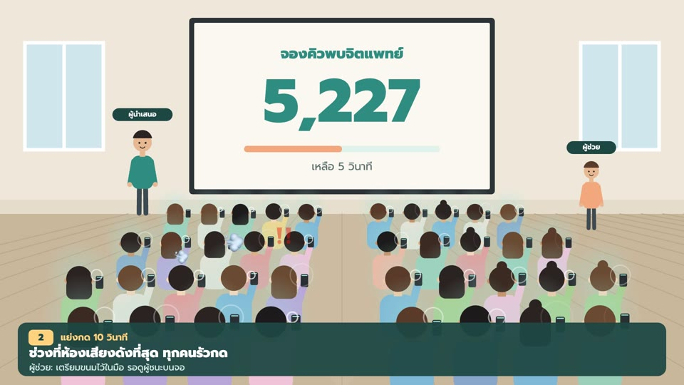

## Screenshots

> The screenshots and videos below show the earlier 5-minute version (tap race → waiting room with bubbles → line-by-line reveal). The current flow is in the table under **Game flow**.

### Big screen (projector)

| Lobby: scan the QR | Race result + claim code |
|---|---|
| 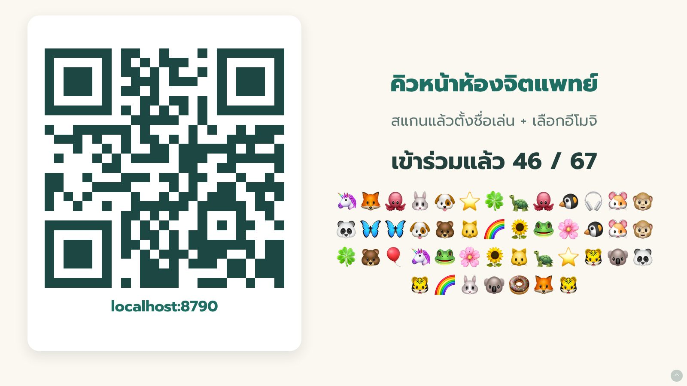 | 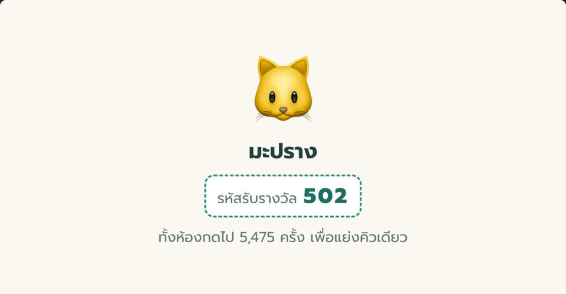 |
| **Waiting room: "now calling" board** | **Cancellation draw** |
| 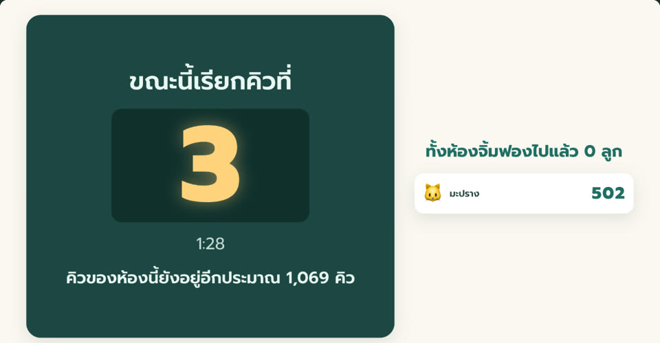 | 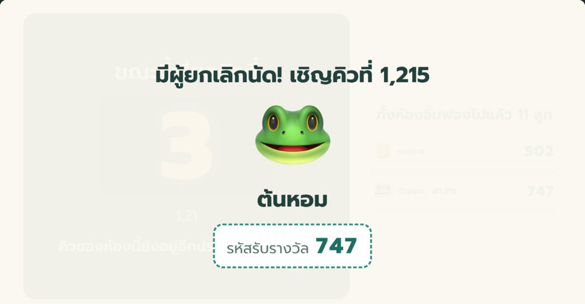 |
| **Reveal: the real numbers** | **End** |
| 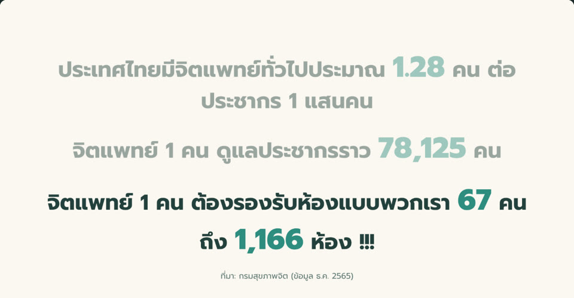 | 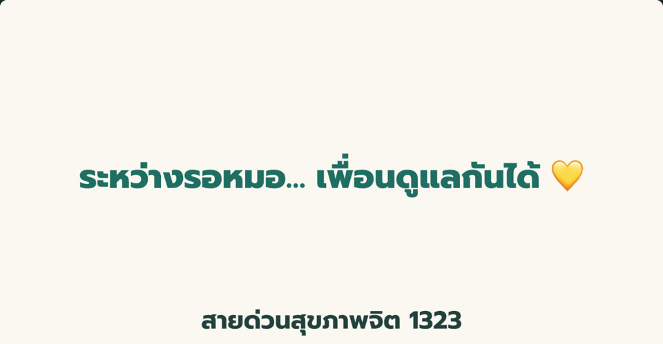 |

### Phones

| Join | Tap race | Queue ticket |
|---|---|---|
| 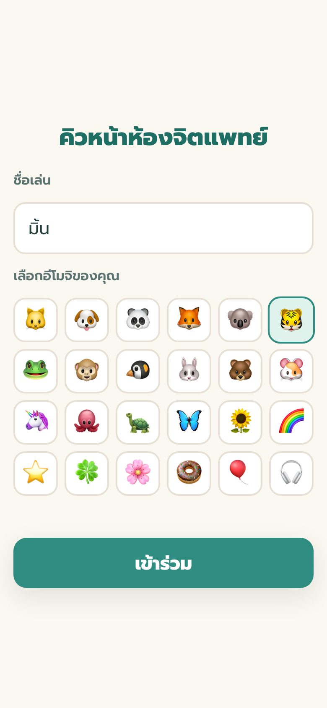 | 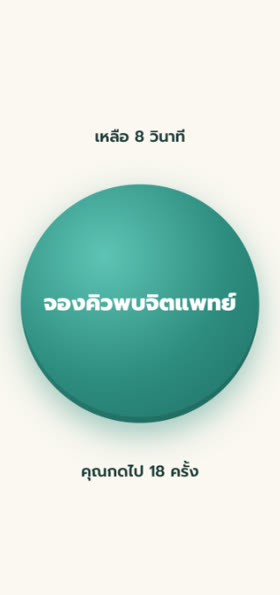 | 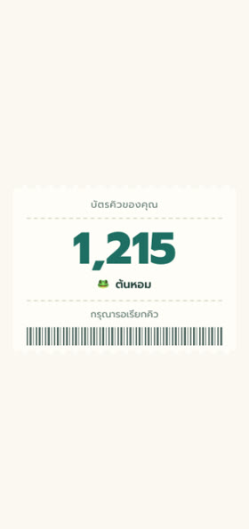 |
| **Bubble pop** | **Breathe together** | **Winner + claim code** |
| 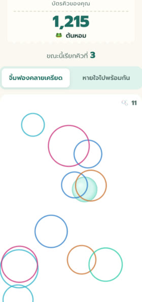 | 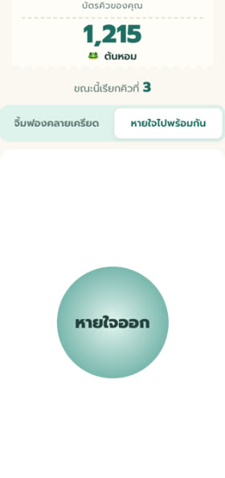 | 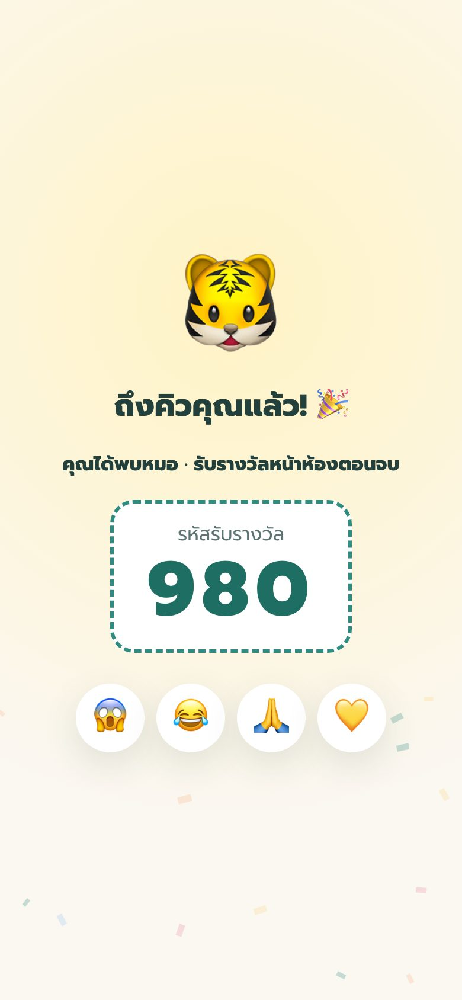 |

### Videos

- [`media/how-to-play.mp4`](media/how-to-play.mp4): how to play from start to finish, using real screens with captions (83 s).
- [`media/classroom-atmosphere.mp4`](media/classroom-atmosphere.mp4): animated preview of the classroom atmosphere for the helper and team (82 s, illustration, not real footage).

Both videos use procedurally generated background music, so there are no copyright issues.

### Game flow

| # | Phase | What happens | Timing |
|---|---|---|---|
| 0 | LOBBY | Everyone scans the QR and picks a nickname + emoji (runs while people walk in) | host presses start |
| 1 | INTRO | "หมอว่าง 1 คิว"; each phone flips a random, fictional patient card: 🔴 very urgent / 🟡 medium / 🟢 not urgent | 10 s |
| 2 | RACE | Red light for a random 2.5–5 s, then green for 6 s. A press before green = false start (back of the queue). Queue order = arrival order of each player's **first** press after green; the big screen shows the top tappers to bait mashing | ~11 s |
| 3 | LINEUP | Every emoji lines up at the exam-room door. Auto twist cards: fastest player, "most taps → queue #38", room total "but only the first tap counted", false starts | 15 s |
| 4 | EVENTS | Four queue events reshuffle the line live: 📄 documents incomplete (front 5 → back), 🏥 free slot at a far hospital (players opt in, 50/50 front or back), 🔀 queue system crash (10 swap), 📞 cancellation (someone from the back half → #1) | 40 s |
| 5 | CALL | Drum roll → ding-dong "ขอเชิญหมายเลข 1" → the winner + 3-digit claim code (**the only prize**) → the line recolours by urgency: "seen: 🟢 · still waiting: 🔴 22" | 15 s |
| 6 | GUESS | "How many rooms like ours per psychiatrist?" 4 choices, live bar chart | 12 s |
| 7 | ZOOM | Answer reveal → our room becomes 1 tile among ~1,166 → statistics + source | 28 s |
| 8 | END | "ระหว่างรอหมอ… เพื่อนดูแลกันได้ 💛", "ask your neighbour how they've been", hotline 1323; snacks passed along each row | — |

Total after start ≈ 2:15. Phones can send emoji reactions (😱😂🙏💛) that float up on the big screen.

Presenter script and checklists: [`RUNSHEET.th.md`](RUNSHEET.th.md) (Thai). Snack-helper guide: [`helper-guide.html`](helper-guide.html).

## Layout

```
src/index.ts        Worker: /ws → Durable Object "main"; everything else → static assets
src/room.ts         GameRoom Durable Object: state machine, sockets, alarms, persistence
src/protocol.ts     WebSocket message + snapshot types (the protocol reference)
src/config.ts       every number in the game (+ stats source)
public/index.html   player page            public/js/player.js, confetti.js
public/host.html    big screen (/host)     public/js/host.js, sfx.js (Web Audio music/SFX + Thai TTS)
public/js/net.js    reconnecting WebSocket + server-clock sync (shared)
public/js/strings.js  all Thai UI strings
scripts/loadtest.mjs  80-player end-to-end load test
docs/screenshots/   README screenshots (earlier version)
media/              how-to-play + classroom-atmosphere videos (earlier version)
helper-guide.html   snack-helper guide (Thai)
RUNSHEET.th.md      presenter run sheet (Thai)
```

## Routes

| Route | Who | Notes |
|---|---|---|
| `/` | players | join + play |
| `/host?key=HOST_KEY` | presenter | key is moved to `sessionStorage` and removed from the address bar on load |
| `/ws` | both | WebSocket; becomes host only if `hello.hostKey` matches the `HOST_KEY` secret |

Host keys: `Space` / `→` / `PageDown` = start (in the lobby) or skip the current phase · `M` = sound on/off · `R` = reset (confirm) · `H` = hide control bar · `F` = fullscreen. Browsers only play audio after a gesture, so any key or click on the host page unlocks sound.

## Setup

Requires Node 18+ (tested with Node 22).

```bash
npm install
```

## Local development

```bash
cp .dev.vars.example .dev.vars   # then put a long random HOST_KEY in it
```

```bash
npm run dev
```

`wrangler dev` listens on `0.0.0.0:8790`, so phones on the same Wi-Fi can open `http://<laptop-LAN-IP>:8790/`.
On the laptop open `http://<laptop-LAN-IP>:8790/host?key=<HOST_KEY>`. Use the LAN IP rather than `localhost` so the QR code points phones at an address they can reach.
(macOS: `ipconfig getifaddr en0` prints the LAN IP.)

Typecheck the Worker:

```bash
npm run typecheck
```

## Deploy

1. Log in once:

   ```bash
   npx wrangler login
   ```

2. Set the host key secret (choose a long random string):

   ```bash
   npx wrangler secret put HOST_KEY
   ```

3. Deploy:

   ```bash
   npm run deploy
   ```

### Custom domain

`wrangler.jsonc` contains:

```jsonc
"routes": [{ "pattern": "queue.korakod.dev", "custom_domain": true }]
```

The `korakod.dev` zone must be in the same Cloudflare account. On deploy, Wrangler creates the DNS record and certificate for the subdomain. To use another name, change `pattern` and deploy again. The `*.workers.dev` URL also stays enabled (`workers_dev: true`) as a fallback.

### Cloudflare plan

Durable Objects work on the **Workers Free** plan, but only with the SQLite storage backend (hence `new_sqlite_classes` in the migration). Free limits: 100,000 requests/day, 13,000 GB-s/day duration, 100,000 row writes/day, and 5 GB storage. Incoming WebSocket messages are billed 20:1. One game with 80 phones uses roughly 10k incoming messages (≈500 billed requests) and a few hundred row writes.
Sources: [DO pricing](https://developers.cloudflare.com/durable-objects/platform/pricing/), [DO limits](https://developers.cloudflare.com/durable-objects/platform/limits/).

## How it works (short)

- **Server-authoritative state machine:** `LOBBY → INTRO → RACE → LINEUP → EVENTS → CALL → GUESS → ZOOM → END`. After the host starts, every phase runs on `config.timeline`; each phase starts exactly when the previous one was scheduled to end, so a late alarm never stretches the timeline. `host:next` skips the current phase. Every phase change and queue event sends a full per-client snapshot.
- **Race:** `goAt` (the green light) is in the snapshot, so every phone turns green at the same server time. A `taps` message arriving before `goAt − foulGraceMs` is a false start; one inside the grace window is ignored. Queue order = server arrival order of each player's first tap after `goAt`, then players who never tapped (shuffled), then false starters. Client timestamps are never trusted.
- **Events and winner:** the four events fire at `config.events.times` (slot 1 is always the gamble; the others are shuffled). The winner is queue #1 at CALL, skipping players with no live socket. Late joiners go to the back of the queue.
- **Counters are cumulative:** `taps` carries a running total and the server keeps the max per player. Resends after a reconnect are therefore idempotent. The server also caps it at a plausible human rate.
- **Clock sync:** clients measure their offset to the server clock with `time` requests and keep the sample with the lowest RTT. The red/green light, the call reveal and the zoom animation are drawn from server time, so a refresh lands on the same moment.
- **Heartbeat:** clients send the literal `ping` and the runtime answers `pong` without waking the DO. Sockets with no ping or message for 45 s are treated as offline and closed (every message refreshes liveness, and clients resync time every 30 s). A client that gets no traffic for 35 s reconnects (exponential backoff with jitter, plus an immediate retry on tab-visible or `online`).
- **Persistence:** hibernation wipes memory, so the game state is also written to the DO's own storage. Important events are written at once; counters at most once per second. `Reset` deletes everything. After 6 h without activity an alarm wipes the data. Only nickname, emoji, the random patient card, queue position, taps and answers are stored.
- **Big screen throttling:** live counters go only to the host, at most every 100 ms (≈10/s) and only when something changed.

## Load test

The test **resets the room**. Never run it against production while a class is playing.

```bash
npm run loadtest
```

```bash
HOST_KEY=<prod key> node scripts/loadtest.mjs https://queue.korakod.dev
```

Options: `--players 80` (default 80). Without a `HOST_KEY` env var it reads `.dev.vars`.

It runs one host and N players through a full game on the real timeline (about 2 min 15 s). During the run:

- players tap ~10/s after the green light with 500 ms batching (first press sent at once);
- two "early birds" press before the green light; ~10 % never tap;
- ~10 % of players drop and reconnect during the race and the events;
- half the players opt into the gamble; everyone answers the guess; some send reactions.

It asserts:

- the lineup is a permutation of all players, false starters at the very back and non-tappers just before them;
- all four events fire and the gamble resolves with lucky + unlucky = movers;
- exactly one winner: queue #1, the only phone with `won`, with the same claim code as the big screen;
- every client ends in END;
- the server tap total equals the per-player sum;
- guess counts match the answers sent, and `roomsNeeded` is correct.

It also prints broadcast latency (avg/p50/p95/max). The process exits non-zero if any assertion fails.

## Configuration

All numbers live in `src/config.ts` and reach the clients inside each snapshot. Examples are the phase durations, the red-light range, event times, guess buckets, and the statistics with their source label. Thai UI text is in `public/js/strings.js`.

The reveal statistic (`psychiatristsPer100k: 1.28`; the source label still says Department of Mental Health, Dec 2022, and must match the figure) **must be re-verified by the presenter before the event.**
